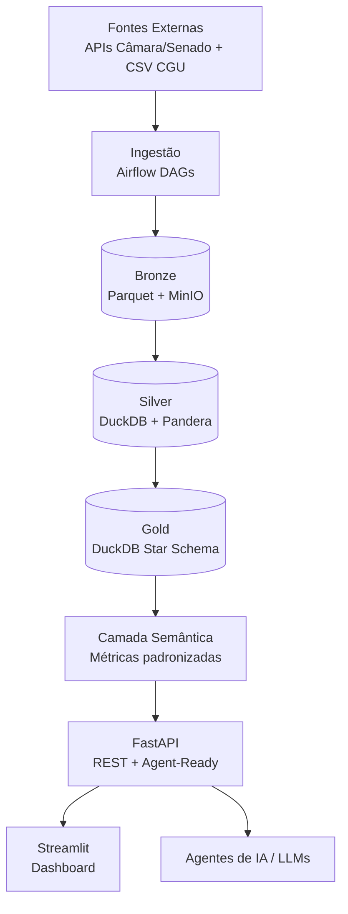

# Plataforma de Inteligência Parlamentar Brasileira

> **Status deste documento:** completo, atualizado ao final da Sprint 9.
> Este README é o documento de apresentação do case para a banca
> avaliadora — distinto do `PROJECT_CONTEXT.md`, que é a fonte de
> verdade técnica interna do projeto.
 
---
 
## I. Objetivo do Case
 
O **Observatório Parlamentar** é uma plataforma de inteligência de dados
voltada à análise exploratória e investigativa dos gastos
parlamentares brasileiros (Câmara dos Deputados, Senado Federal e
Portal da Transparência da CGU).
 
O projeto nasce da constatação de que dados públicos sobre gastos
parlamentares existem, mas estão dispersos, em formatos
inconsistentes e sem camada analítica que permita responder perguntas
como:
 
- Quais fornecedores concentram os maiores volumes de recursos públicos?
- Quais parlamentares compartilham fornecedores entre si?
- Existem padrões incomuns de despesas que sugerem irregularidade?
- Como se estruturam as redes de relacionamento entre parlamentares,
  partidos e empresas fornecedoras?
Mais do que um painel de Business Intelligence, o projeto foi
concebido como um exercício completo de **Engenharia de Dados**:
extração multi-fonte, arquitetura em camadas (medalhão), detecção de
anomalias via Machine Learning, cálculo de índices de risco, análise
de redes e exposição via API pronta para consumo por dashboards e
agentes de IA.
 
**Público-alvo:** jornalistas investigativos, pesquisadores
acadêmicos, órgãos de controle (TCU/CGU/MP), cidadãos engajados em
transparência pública e — no contexto deste case — avaliadores
técnicos interessados em arquitetura de dados end-to-end.
 
**Vínculo com o desafio proposto:** este case foi estruturado para
cobrir explicitamente os 8 tópicos exigidos — extração, ingestão,
armazenamento, observabilidade, segurança, mascaramento, arquitetura
e escalabilidade — usando dados públicos reais de gastos
parlamentares como domínio de aplicação.
 
---
 
## II. Arquitetura de Solução e Arquitetura Técnica
 
### II.1 Visão Geral (Arquitetura Medalhão)
 

 
### II.2 Justificativa das Escolhas Tecnológicas
 
| Componente | Tecnologia escolhida | Alternativas consideradas | Justificativa |
|---|---|---|---|
| Orquestração | Apache Airflow | Prefect, Dagster, cron simples | DAGs versionadas, retry nativo, observabilidade madura, padrão de mercado |
| Storage raw | Parquet + MinIO | S3 diretamente, HDFS | MinIO é S3-compatible e open source, permite rodar 100% on-premises/local sem custo de nuvem; Parquet é columnar e eficiente para o volume do projeto |
| Banco analítico | DuckDB | PostgreSQL, BigQuery, Redshift | Serverless, OLAP embarcado, zero infraestrutura de cluster para o volume de dados esperado (gastos parlamentares desde 2015 — dezenas de milhões de linhas, não bilhões); BigQuery/Redshift trariam custo e complexidade operacional desnecessários nesta escala |
| Transformação | dbt Core | Spark SQL, Pandas puro | Versionamento SQL, lineage automático, testes declarativos nativos |
| Validação | Pandera | Great Expectations | API mais leve, integração nativa com Pandas/tipagem Python |
| API | FastAPI | Flask, Django REST | Performance assíncrona, OpenAPI automático, tipagem Pydantic — essencial para os endpoints agent-ready |
| Dashboard | Streamlit | Dash, Metabase | Menor tempo de desenvolvimento para camada de apresentação, adequado ao escopo de portfólio |
 
### II.3 Ingestão: Batch vs. Streaming (Kappa/Lambda)

> Decisão formalizada em ADR-009 (`ADR.md`). Resumo abaixo.

**Decisão adotada:** arquitetura **batch (estilo Lambda simplificado,
sem camada de velocidade dedicada)**, com ingestão incremental diária
via watermark.
 
**Justificativa:** dados de gastos parlamentares são publicados pelas
APIs oficiais em batelada (atualização diária/mensal, não em tempo
real por natureza da fonte). Não há requisito de negócio que exija
latência sub-diária — nenhuma persona (jornalista, pesquisador,
analista de controle) precisa de dado no minuto em que a despesa é
registrada.
 
**Por que não Kappa/streaming puro:** exigiria um broker de mensagens
(Kafka/Redpanda) sem ganho real, já que a fonte de dados não é
nativamente um stream — seria streaming artificial sobre uma API
batch, adicionando complexidade sem benefício.
 
**Caminho de evolução (documentado como melhoria futura, não
implementado no MVP):** caso o escopo evolua para incluir fontes
realmente contínuas (ex: monitoramento de redes sociais de
parlamentares, cotação de ações de empresas fornecedoras), a
arquitetura permite introduzir uma camada de streaming (Kafka +
Spark Structured Streaming) em paralelo ao batch existente,
caracterizando uma migração para Lambda arquitetural completa, sem
necessidade de reescrever as camadas Bronze/Silver/Gold já
estabelecidas.
 
### II.4 Escalabilidade
 
| Eixo | Estratégia | Quando seria necessário |
|---|---|---|
| **Vertical** | DuckDB escala verticalmente (mais CPU/RAM na mesma máquina) — suficiente até dezenas de GB / centenas de milhões de linhas | Cenário atual e projeção de 10+ anos de histórico parlamentar |
| **Horizontal (dados)** | Particionamento Parquet por ano/fonte no MinIO; paralelização de extração por fonte (Câmara/Senado/CGU rodam como DAGs independentes no Airflow) | Se o número de fontes crescer (ex: 27 assembleias estaduais) |
| **Horizontal (processamento)** | Migração de dbt Core (DuckDB) para dbt + Spark/Databricks, caso o volume ultrapasse a capacidade de um único nó | Cenário hipotético de expansão para dados eleitorais completos do TSE (bilhões de registros) |
| **API** | FastAPI é stateless por design — escala horizontalmente atrás de um load balancer, múltiplas réplicas via Docker/Kubernetes | Aumento de demanda concorrente de consultas |
 
A escolha por DuckDB não compromete a escalabilidade futura: a
migração para um motor distribuído (Spark, Trino) reaproveitaria o
mesmo modelo dimensional e os mesmos arquivos Parquet em Bronze,
já que o desenho do Data Lake é agnóstico ao motor de consulta.
 
### II.5 Segurança e Mascaramento de Dados
 
- **Pseudonimização de CPF (ADR-004/ADR-033):** fornecedores pessoa
  física têm o CPF substituído por HMAC-SHA256 com chave secreta na
  camada **Silver** — a fronteira de pseudonimização. A Bronze mantém o
  dado bruto equivalente-público (CPF de fonte pública oficial, acesso
  restrito no MinIO); a partir da Silver o valor hasheado é o único
  consumido pelo Gold e pela API, que nunca re-hasham. A chave é
  gerenciada via GitHub Secrets/`.env`, nunca versionada em código.
- **Por que HMAC e não hash simples com salt fixo:** o espaço de
  CPFs válidos é finito e computável, tornando um hash com salt fixo
  vulnerável a ataque de força bruta/rainbow table. HMAC-SHA256 com
  chave secreta elimina essa vulnerabilidade, mantendo o join
  determinístico necessário para análise (mesmo CPF → mesmo hash).
- **Base legal (LGPD):** interesse público / transparência (Art. 7º,
  III), já que a fonte é dado público oficial; ainda assim, CPF é
  tratado como dado pessoal sensível: a Bronze o mantém apenas como
  dado bruto equivalente-público sob acesso restrito, e as camadas
  consumíveis (Silver/Gold/API) só expõem o hash.
- **Controle de acesso:** API pública para dados agregados;
  endpoints que retornassem dado individual sensível (nenhum
  planejado no MVP) exigiriam autenticação — item já registrado no
  backlog futuro.
- **Exemplo prático de mascaramento** (aplicado no `transform.py` de
  cada fonte, camada Silver — `pipeline/pseudonymize.py`):
```python
import hmac
import hashlib
import os
 
def pseudonymize_cpf(cpf: str) -> str:
    """Pseudonimiza um CPF via HMAC-SHA256 (Silver, ADR-033).
 
    Args:
        cpf: CPF em texto claro, apenas dígitos.
 
    Returns:
        Hash hexadecimal determinístico do CPF.
    """
    secret_key = os.environ["CPF_HMAC_SECRET_KEY"].encode()
    return hmac.new(secret_key, cpf.encode(), hashlib.sha256).hexdigest()
```
 
### II.6 Observabilidade

A observabilidade é tratada em quatro camadas complementares:

**1. Logging estruturado (`structlog`).** Todos os módulos do pipeline
(`bronze.py`, `silver.py`, `quality.py`, extract/transform das fontes,
`utils.py`) emitem logs estruturados via `structlog` com `run_id`,
`fonte` e contexto da etapa. O formato é configurado em
`config/pipeline.yaml` (`logging.formato: json`), com
`TimeStamper(utc=True)` e renderização JSON em produção /
console em dev (`pipeline/logging.py`).

**2. Rastreabilidade por execução (RF-12).** Toda carga é gravada com o
trio `run_id` / `pipeline_version` / `execution_timestamp` (padrão
`COLUNAS_AUDITORIA`), permitindo reprojetar o estado do dado em qualquer
ponto da cadeia. O `run_id` nasce na Bronze, atravessa a Silver via XCom
do Airflow e chega ao Gold — a mesma execução é rastreável de ponta a
ponta.

**3. Data Quality Report.** A cada execução da Silver, o
`pipeline/quality.py` avalia nulos críticos, quarentena e deduplicação,
persistindo o relatório em `data_quality_report` (ADR-015/031). O
relatório é promovido à Gold pelo dbt e exposto via
`GET /qualidade/relatorio` — o dashboard mostra o resumo na página de
Qualidade.

**4. Controle de execuções (`pipeline_runs`).** A tabela Gold
`pipeline_runs` (ADR-019) registra o status de cada execução
(`success`/`partial`/`failed`), as fontes com erro e os watermarks por
fonte. É consumida por `GET /pipeline/status` e pela página Metadados do
dashboard.

**Estratégia de alertas (deferida — registrada no BACKLOG §IV):** a
detecção de falha de extração, queda abrupta de volume e degradação de
qualidade é observável via logs e `pipeline_runs`, mas **alertas
proativos** (e-mail/Webhook) ficam fora do escopo do MVP. A execução
diária em produção (ADR-034, Sprint 9) roda sob `systemd timer` com
logs em `journalctl` — a falha é registrada no estado do service e
visível na auditoria da execução.

---

## III. Explicação sobre o Case Desenvolvido

> Seções II.1–II.5 descrevem a arquitetura projetada; esta seção
> documenta o que foi **efetivamente implementado e validado** nas
> Sprints 2–8.

### III.1 O que foi construído

O pipeline end-to-end descrito na arquitetura medalhão está **implementado
e validado com dados reais** das quatro fontes oficiais (Câmara, Senado,
CGU Transparência e CGU Cartão), com execução comprovada na validação E2E
da Sprint 6.5:

| Camada | Realidade implementada |
|---|---|
| **Bronze** | Extração incremental (watermark) das APIs/bases públicas, persistência em Parquet particionado por `ano/mes` no MinIO, retry com backoff exponencial (ADR-009), rate limiting por fonte. Validação real: 4 fontes `success` em modo validação. |
| **Silver** | Limpeza, padronização multi-fonte (`normalize.py`), deduplicação independente por camada (ADR-013), validação com Pandera, pseudonimização de CPF via HMAC-SHA256 (ADR-033) e Data Quality Report. Validação real: Câmara 9.350 + Senado 63.874 registros de despesa; parlamentares 514 + 162; cartão ~120 mil; emenda 45.799. |
| **Gold** | Star Schema (Fact Constellation) via dbt Core sobre DuckDB, com SCD Type 2 em `dim_parlamentar` (ADR-017), quarentena por construção (ADR-018), `pipeline_runs` (ADR-019) e tabelas analíticas (ADR-021). Validação real: `dbt build` **PASS=224, ERROR=0**, 12 execuções em `pipeline_runs`. |
| **Analytics** | Anomalias estatísticas (Z-score + Isolation Forest, ADR-002), scorecard de risco (ADR-027/029), análise de redes parlamentar↔fornecedor (ADR-030), feature store (ADR-028). |
| **API** | FastAPI REST com 30+ endpoints, OpenAPI/Swagger, paginação/filtros, e endpoints agent-ready (`/agent/*`, ADR-032) para consumo por LLMs — validada contra o Gold real do dbt via teste de contrato pipeline→Gold→API. |
| **Dashboard** | Streamlit com 10 páginas (visão geral, parlamentar, partido, estado, fornecedor, rede, anomalias, ML/risco, qualidade, metadados), exportações CSV/Excel/PDF (RF-08). |

### III.2 Números reais da validação

Os valores abaixo foram produzidos na **validação end-to-end com dados
reais** (Sprint 6.5) e renderizados no dashboard contra o DuckDB de
desenvolvimento (Sprint 7):

- **Volume processado:** 8.983 transações de despesa, **R$ 4,5 milhões**
  em gasto total, 4.319 fornecedores e 432 parlamentares no recorte
  validado.
- **Qualidade:** relatório de qualidade gerado por execução com
  percentual de nulos críticos, quarentena e deduplicação.
- **Confiança do pipeline:** suíte automatizada com **374 testes verdes**
  (1 skip opcional do Airflow), cobertura de **93,6%**, lint Ruff verde e
  gate de cobertura `fail_under = 80` ativo (Sprint 8).

### III.3 Exemplo de fluxo real

1. O DAG `observatorio_pipeline` (Airflow) dispara diariamente
   (Bronze → Silver → Gold), com execução controlada por `run_id`.
2. A Bronze extrai incrementos por watermark; a Silver valida com
   Pandera, deduplica e pseudonimiza CPFs; a Gold roda `dbt build`
   materializando o Star Schema.
3. A camada analítica calcula anomalias, risco e rede; tudo é exposto
   pela FastAPI.
4. O dashboard consome a API e renderiza KPIs, grafos e exportações —
   dados reais, sem mock.

### III.4 Deploy e operação

Para instalar, fazer deploy e operar o ambiente, consulte
[`docs/guia_deploy_operacao.md`](docs/guia_deploy_operacao.md)
(Docker Compose, deploy na VPS Oracle, execução diária via systemd —
ADR-034) e [`docs/guia_provisionamento_oci.md`](docs/guia_provisionamento_oci.md)
(provisionamento da infraestrutura Oracle Cloud).

> **Avaliação da banca:** consulte também o `PROJECT_CONTEXT.md` (fonte de
> verdade técnica, com ADRs 001-034), o `ADR.md` (decisões arquiteturais
> formalizadas) e o `BACKLOG.md` (rastro completo das sprints 0A–9).

---
 
## IV. Melhorias e Considerações Finais
 
### Backlog de melhorias futuras (fora do escopo do MVP)
 
- Cruzamento com dados eleitorais do TSE
- Enriquecimento de fornecedores via classificação CNAE
- Autenticação/autorização de usuários na API
- Alertas automáticos/notificações proativas de anomalias detectadas
- Versionamento multi-tenant do dashboard
- Evolução para arquitetura Lambda completa caso surjam fontes
  nativamente contínuas (streaming real)
- Migração de DuckDB para motor distribuído (Spark/Trino), caso o
  volume ultrapasse a capacidade de processamento em nó único
### Riscos e limitações conhecidas
 
- Dependência de disponibilidade e estabilidade das APIs públicas
  (Câmara/Senado não possuem SLA formal documentado)
- `risk_index` com pesos uniformes é baseline explícito, não
  calibrado empiricamente até a Sprint 5
- Ausência de autenticação na API pública é aceitável apenas porque
  os dados expostos são públicos por natureza — não seria uma
  decisão válida em outro domínio
### Considerações finais
 
O projeto foi desenhado para demonstrar domínio completo do ciclo de
Engenharia de Dados — da extração à exposição via API — priorizando
decisões justificadas e documentadas (ADRs) sobre implementação
apressada. A arquitetura escolhida é deliberadamente simples onde a
simplicidade é suficiente (DuckDB em vez de cluster distribuído) e
deixa caminhos claros de evolução onde o volume ou a natureza dos
dados justificar maior complexidade no futuro.
 
---
 
*Documento vivo — atualizado ao final de cada sprint pelo papel de
Documentador, em conjunto com `PROJECT_CONTEXT.md`, `ADR.md` e
`BACKLOG.md`.*
 
