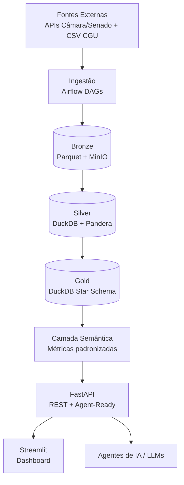

# Plataforma de Inteligência Parlamentar Brasileira
 
> **Status deste documento:** rascunho vivo, iniciado na Sprint 0B.
> Seções marcadas como `[PENDENTE]` serão preenchidas conforme as
> sprints correspondentes forem concluídas. Este README é o
> documento de apresentação do case para a banca avaliadora —
> distinto do `PROJECT_CONTEXT.md`, que é a fonte de verdade técnica
> interna do projeto.
 
---
 
## I. Objetivo do Case
 
O **Observatório Parlamentar** é uma plataforma de inteligência de dados
voltada à análise exploratória e investigativa dos gastos
parlamentares brasileiros (Câmara dos Deputados, Senado Federal e
Portal da Transparência da CGU).
 
O projeto nasce da constatação de que dados públicos sobre gastos
parlamentares existem, mas estão dispersos, em formatos
inconsistentes e sem camada analítica que permita responder perguntas
como:
 
- Quais fornecedores concentram os maiores volumes de recursos públicos?
- Quais parlamentares compartilham fornecedores entre si?
- Existem padrões incomuns de despesas que sugerem irregularidade?
- Como se estruturam as redes de relacionamento entre parlamentares,
  partidos e empresas fornecedoras?
Mais do que um painel de Business Intelligence, o projeto foi
concebido como um exercício completo de **Engenharia de Dados**:
extração multi-fonte, arquitetura em camadas (medalhão), detecção de
anomalias via Machine Learning, cálculo de índices de risco, análise
de redes e exposição via API pronta para consumo por dashboards e
agentes de IA.
 
**Público-alvo:** jornalistas investigativos, pesquisadores
acadêmicos, órgãos de controle (TCU/CGU/MP), cidadãos engajados em
transparência pública e — no contexto deste case — avaliadores
técnicos interessados em arquitetura de dados end-to-end.
 
**Vínculo com o desafio proposto:** este case foi estruturado para
cobrir explicitamente os 8 tópicos exigidos — extração, ingestão,
armazenamento, observabilidade, segurança, mascaramento, arquitetura
e escalabilidade — usando dados públicos reais de gastos
parlamentares como domínio de aplicação.
 
---
 
## II. Arquitetura de Solução e Arquitetura Técnica
 
### II.1 Visão Geral (Arquitetura Medalhão)
 

 
### II.2 Justificativa das Escolhas Tecnológicas
 
| Componente | Tecnologia escolhida | Alternativas consideradas | Justificativa |
|---|---|---|---|
| Orquestração | Apache Airflow | Prefect, Dagster, cron simples | DAGs versionadas, retry nativo, observabilidade madura, padrão de mercado |
| Storage raw | Parquet + MinIO | S3 diretamente, HDFS | MinIO é S3-compatible e open source, permite rodar 100% on-premises/local sem custo de nuvem; Parquet é columnar e eficiente para o volume do projeto |
| Banco analítico | DuckDB | PostgreSQL, BigQuery, Redshift | Serverless, OLAP embarcado, zero infraestrutura de cluster para o volume de dados esperado (gastos parlamentares desde 2015 — dezenas de milhões de linhas, não bilhões); BigQuery/Redshift trariam custo e complexidade operacional desnecessários nesta escala |
| Transformação | dbt Core | Spark SQL, Pandas puro | Versionamento SQL, lineage automático, testes declarativos nativos |
| Validação | Pandera | Great Expectations | API mais leve, integração nativa com Pandas/tipagem Python |
| API | FastAPI | Flask, Django REST | Performance assíncrona, OpenAPI automático, tipagem Pydantic — essencial para os endpoints agent-ready |
| Dashboard | Streamlit | Dash, Metabase | Menor tempo de desenvolvimento para camada de apresentação, adequado ao escopo de portfólio |
 
### II.3 Ingestão: Batch vs. Streaming (Kappa/Lambda)

> Decisão formalizada em ADR-009 (`ADR.md`). Resumo abaixo.

**Decisão adotada:** arquitetura **batch (estilo Lambda simplificado,
sem camada de velocidade dedicada)**, com ingestão incremental diária
via watermark.
 
**Justificativa:** dados de gastos parlamentares são publicados pelas
APIs oficiais em batelada (atualização diária/mensal, não em tempo
real por natureza da fonte). Não há requisito de negócio que exija
latência sub-diária — nenhuma persona (jornalista, pesquisador,
analista de controle) precisa de dado no minuto em que a despesa é
registrada.
 
**Por que não Kappa/streaming puro:** exigiria um broker de mensagens
(Kafka/Redpanda) sem ganho real, já que a fonte de dados não é
nativamente um stream — seria streaming artificial sobre uma API
batch, adicionando complexidade sem benefício.
 
**Caminho de evolução (documentado como melhoria futura, não
implementado no MVP):** caso o escopo evolua para incluir fontes
realmente contínuas (ex: monitoramento de redes sociais de
parlamentares, cotação de ações de empresas fornecedoras), a
arquitetura permite introduzir uma camada de streaming (Kafka +
Spark Structured Streaming) em paralelo ao batch existente,
caracterizando uma migração para Lambda arquitetural completa, sem
necessidade de reescrever as camadas Bronze/Silver/Gold já
estabelecidas.
 
### II.4 Escalabilidade
 
| Eixo | Estratégia | Quando seria necessário |
|---|---|---|
| **Vertical** | DuckDB escala verticalmente (mais CPU/RAM na mesma máquina) — suficiente até dezenas de GB / centenas de milhões de linhas | Cenário atual e projeção de 10+ anos de histórico parlamentar |
| **Horizontal (dados)** | Particionamento Parquet por ano/fonte no MinIO; paralelização de extração por fonte (Câmara/Senado/CGU rodam como DAGs independentes no Airflow) | Se o número de fontes crescer (ex: 27 assembleias estaduais) |
| **Horizontal (processamento)** | Migração de dbt Core (DuckDB) para dbt + Spark/Databricks, caso o volume ultrapasse a capacidade de um único nó | Cenário hipotético de expansão para dados eleitorais completos do TSE (bilhões de registros) |
| **API** | FastAPI é stateless por design — escala horizontalmente atrás de um load balancer, múltiplas réplicas via Docker/Kubernetes | Aumento de demanda concorrente de consultas |
 
A escolha por DuckDB não compromete a escalabilidade futura: a
migração para um motor distribuído (Spark, Trino) reaproveitaria o
mesmo modelo dimensional e os mesmos arquivos Parquet em Bronze,
já que o desenho do Data Lake é agnóstico ao motor de consulta.
 
### II.5 Segurança e Mascaramento de Dados
 
- **Pseudonimização de CPF (ADR-004):** fornecedores pessoa física
  têm o CPF substituído por HMAC-SHA256 com chave secreta antes de
  qualquer persistência — inclusive na camada Bronze. A chave é
  gerenciada via GitHub Secrets/`.env`, nunca versionada em código.
- **Por que HMAC e não hash simples com salt fixo:** o espaço de
  CPFs válidos é finito e computável, tornando um hash com salt fixo
  vulnerável a ataque de força bruta/rainbow table. HMAC-SHA256 com
  chave secreta elimina essa vulnerabilidade, mantendo o join
  determinístico necessário para análise (mesmo CPF → mesmo hash).
- **Base legal (LGPD):** interesse público / transparência (Art. 7º,
  III), já que a fonte é dado público oficial; ainda assim, CPF é
  tratado como dado pessoal sensível e nunca exposto em texto claro.
- **Controle de acesso:** API pública para dados agregados;
  endpoints que retornassem dado individual sensível (nenhum
  planejado no MVP) exigiriam autenticação — item já registrado no
  backlog futuro.
- **Exemplo prático de mascaramento:**
```python
import hmac
import hashlib
import os
 
def pseudonymize_cpf(cpf: str) -> str:
    """Pseudonimiza um CPF via HMAC-SHA256.
 
    Args:
        cpf: CPF em texto claro, apenas dígitos.
 
    Returns:
        Hash hexadecimal determinístico do CPF.
    """
    secret_key = os.environ["CPF_HMAC_SECRET_KEY"].encode()
    return hmac.new(secret_key, cpf.encode(), hashlib.sha256).hexdigest()
```
 
### II.6 Observabilidade
 
`[PENDENTE — a ser detalhado na Sprint 0B/2]`
 
Direção já definida: logging estruturado (`structlog`) em todos os
módulos do pipeline, Data Quality Report gerado a cada execução do
Silver, e `run_id`/`pipeline_version`/`execution_timestamp` em toda
carga para rastreabilidade. Falta formalizar: métricas de duração
por etapa do DAG, taxa de sucesso histórica e estratégia de alertas
(ex: falha de extração, queda abrupta de volume ingerido).
 
---
 
## III. Explicação sobre o Case Desenvolvido
 
`[PENDENTE]`
 
Esta seção descreverá o funcionamento real do pipeline implementado
— exemplos de execução, dados efetivamente extraídos e processados,
telas do dashboard, respostas da API — e só pode ser escrita com
conteúdo verídico à medida que as sprints de implementação (2 a 7)
forem concluídas. Documentar aqui, agora, um comportamento ainda não
implementado passaria uma imagem incorreta do estágio real do
projeto para a banca.
 
O que já pode ser afirmado com precisão nesta fase (Sprint 0B):
todas as decisões arquiteturais que guiarão essa implementação estão
formalizadas em ADRs (`ADR.md`) e no `PROJECT_CONTEXT.md`, seguindo
o ciclo proposta → revisão → aprovação → avanço.
 
---
 
## IV. Melhorias e Considerações Finais
 
### Backlog de melhorias futuras (fora do escopo do MVP)
 
- Cruzamento com dados eleitorais do TSE
- Enriquecimento de fornecedores via classificação CNAE
- Autenticação/autorização de usuários na API
- Alertas automáticos/notificações proativas de anomalias detectadas
- Versionamento multi-tenant do dashboard
- Evolução para arquitetura Lambda completa caso surjam fontes
  nativamente contínuas (streaming real)
- Migração de DuckDB para motor distribuído (Spark/Trino), caso o
  volume ultrapasse a capacidade de processamento em nó único
### Riscos e limitações conhecidas
 
- Dependência de disponibilidade e estabilidade das APIs públicas
  (Câmara/Senado não possuem SLA formal documentado)
- `risk_index` com pesos uniformes é baseline explícito, não
  calibrado empiricamente até a Sprint 5
- Ausência de autenticação na API pública é aceitável apenas porque
  os dados expostos são públicos por natureza — não seria uma
  decisão válida em outro domínio
### Considerações finais
 
O projeto foi desenhado para demonstrar domínio completo do ciclo de
Engenharia de Dados — da extração à exposição via API — priorizando
decisões justificadas e documentadas (ADRs) sobre implementação
apressada. A arquitetura escolhida é deliberadamente simples onde a
simplicidade é suficiente (DuckDB em vez de cluster distribuído) e
deixa caminhos claros de evolução onde o volume ou a natureza dos
dados justificar maior complexidade no futuro.
 
---
 
*Documento vivo — atualizado ao final de cada sprint pelo papel de
Documentador, em conjunto com `PROJECT_CONTEXT.md`, `ADR.md` e
`BACKLOG.md`.*
 
