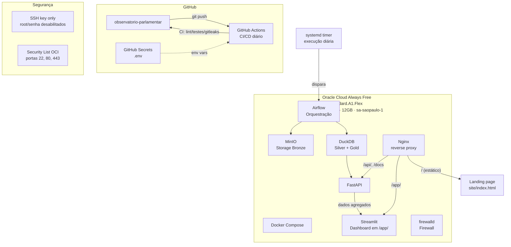

# Arquitetura de Deploy

## Componentes

| Componente | Função | Custo |
|---|---|---|
| **Oracle Cloud A1.Flex** | Compute (Docker Compose: Nginx + API + Dashboard + Airflow + DuckDB + MinIO) | R$ 0/mês |
| **GitHub Actions** | CI/CD diário | R$ 0/mês (público) |
| **MinIO** | Object storage camada Bronze | Docker local (sem custo adicional) |

> **Nota de reconciliação (26/08/2026):** o ADR-007 original (Sprint 0B)
> havia desenhado um deploy split, com o dashboard no Streamlit
> Community Cloud consumindo a API remota. Esse tier nunca foi usado —
> desde a primeira implementação até a Sprint 10, o dashboard sempre
> rodou no mesmo Docker Compose da VPS Oracle. O ADR-036 (Sprint 10)
> formaliza o estado real: Nginx roteando `/app/` → Streamlit,
> `/api/`+`/docs` → FastAPI, `/` → landing estática. Diagrama e tabela
> acima corrigidos para refletir a arquitetura de fato implementada.

## Fluxo de CI/CD

1. Push na branch `main` dispara GitHub Actions
2. Pipeline executa ingestão, transformação e carga
3. API FastAPI e Dashboard Streamlit (`/app/`) são servidos juntos na
   Oracle Cloud, atrás do mesmo Nginx
