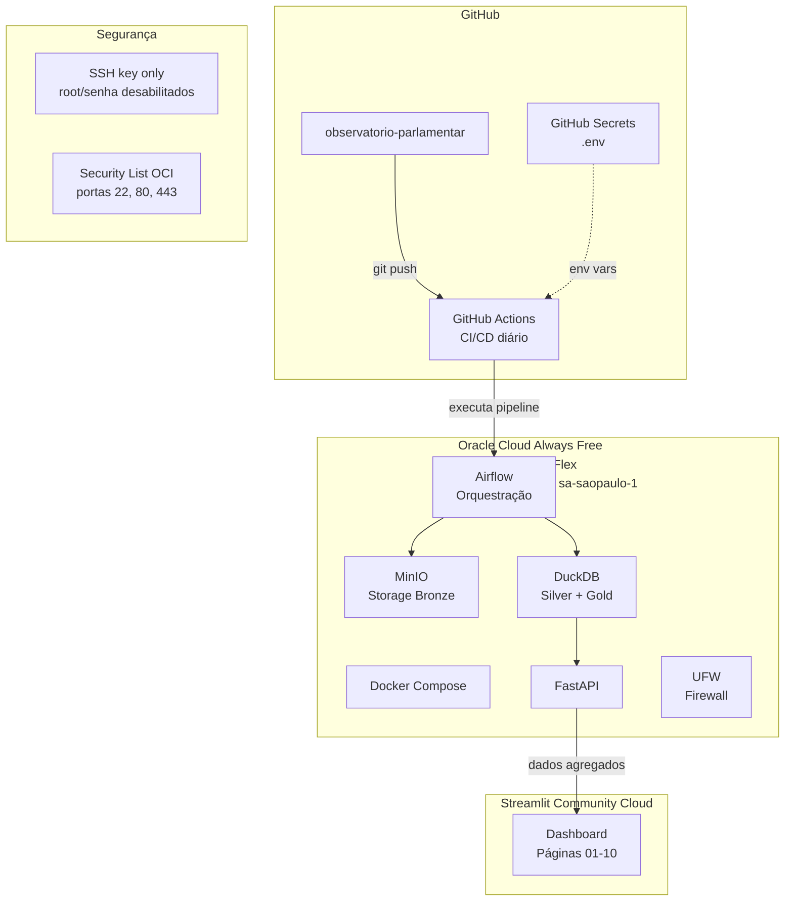

# Arquitetura de Deploy

## Componentes

| Componente | Função | Custo |
|---|---|---|
| **Oracle Cloud A1.Flex** | Compute (Docker Compose + Airflow + DuckDB + API) | R$ 0/mês |
| **Streamlit Community Cloud** | Dashboard público | R$ 0/mês |
| **GitHub Actions** | CI/CD diário | R$ 0/mês (público) |
| **MinIO** | Object storage camada Bronze | Docker local (sem custo adicional) |

## Fluxo de CI/CD

1. Push na branch `main` dispara GitHub Actions
2. Pipeline executa ingestão, transformação e carga
3. API FastAPI é servida na Oracle Cloud
4. Dashboard Streamlit consome a API
