# arch_er.md
# Modelo ER — Gold Layer (estado atual, tabelas materializadas)

> Atualizado a partir da leitura dos modelos dbt em `pipeline/gold/models` (e
> do seed `dim_orgao`). Este diagrama descreve as **tabelas reais materializadas**
> pela Gold (DuckDB, ADR-001/ADR-008), não um modelo-alvo conceitual: os
> efêmeros (`desp_parlamento`, `emenda_autor`, `cartao_unidade`, etc.) são CTEs
> inlined pelo dbt — **não geram tabela** — e aparecem documentados na seção
> "Modelos efêmeros (não-materializados)".

```mermaid
erDiagram
    dim_orgao ||--o{ dim_unidade_gestora : "id_orgao (sigla=EX)"
    dim_orgao ||--o{ fact_despesa : "id_orgao (CD/SF via fonte)"
    dim_orgao ||--o{ fact_emenda : "id_orgao (CD/SF via fonte)"
    dim_orgao ||--o{ fact_cartao_cpgf : "id_orgao (sigla=EX)"

    dim_unidade_gestora ||--o{ fact_cartao_cpgf : "id_unidade_gestora (NOT NULL)"

    dim_parlamentar ||--o{ fact_despesa : "id_parlamentar + surrogate_key (1:1)"
    dim_parlamentar ||--o{ fact_emenda : "id_parlamentar + surrogate_key (1:1)"

    dim_fornecedor ||--o{ fact_despesa : "id_fornecedor (NOT NULL)"
    dim_fornecedor ||--o{ fact_cartao_cpgf : "id_fornecedor (nullable)"

    dim_categoria_despesa ||--o{ fact_despesa : "cod_tipo"

    dim_data ||--o{ fact_despesa : "data_sk (data_documento)"
    dim_data ||--o{ fact_emenda : "data_sk (31-dez do ano)"
    dim_data ||--o{ fact_cartao_cpgf : "data_sk (data_transacao)"

    dim_parlamentar ||--o{ risk_scores : "id_parlamentar (exists)"
    dim_parlamentar ||--o{ network_nodes : "id_no (tipo_no=parlamentar)"
    dim_fornecedor ||--o{ network_nodes : "id_no (tipo_no=fornecedor)"
    dim_parlamentar ||--o{ network_edges : "id_parlamentar"
    dim_fornecedor ||--o{ network_edges : "id_fornecedor"
    dim_parlamentar ||--o{ politician_similarity : "id_parlamentar_a"
    dim_parlamentar ||--o{ politician_similarity : "id_parlamentar_b"

    fact_despesa ||--o{ expense_outliers : "id_despesa (inner join)"
    fact_despesa ||--o{ supplier_concentration : "agrega (ano, id_parlamentar)"
    fact_despesa ||--o{ supplier_growth : "agrega (ano, id_fornecedor)"

    dim_orgao {
        bigint id_orgao PK "seed; 1=CD 2=SF 3=EX"
        varchar poder
        varchar instituicao
        varchar sigla "chave natural"
        varchar ug_siafi "nullable"
        varchar gestao "nullable, so com ug_siafi"
    }

    dim_unidade_gestora {
        bigint id_unidade_gestora PK
        varchar codigo "chave natural composta c/ fonte_origem"
        varchar gestao "NULL (especifico SIAFI)"
        varchar nome
        bigint id_orgao FK "sigla=EX"
        varchar fonte_origem "CGU"
    }

    dim_parlamentar {
        bigint surrogate_key PK "SCD2 - versao do registro"
        varchar fonte "camara|senado"
        bigint id_parlamentar "chave natural por fonte"
        varchar nome
        varchar nome_normalizado
        varchar sigla_partido
        varchar sigla_uf
        varchar situacao_normalizada
        bigint id_legislatura
        date effective_date "SCD2"
        date end_date "SCD2, nullable"
        boolean is_current "SCD2"
    }

    dim_fornecedor {
        bigint id_fornecedor PK
        varchar cnpj_cpf_valor "CNPJ claro / CPF HMAC-SHA256"
        varchar tipo_documento "CNPJ|CPF"
        varchar nome_fornecedor
        bigint id_municipio "sempre NULL na v1"
    }

    dim_categoria_despesa {
        varchar cod_tipo PK "12 hex de md5(upper(tipo_despesa))"
        varchar descricao
    }

    dim_data {
        bigint data_sk PK "YYYYMMDD"
        date data
        int ano
        int mes
        int dia
        int trimestre
        int dia_semana_num
        varchar dia_semana_nome
        varchar mes_nome
        boolean is_dia_util
    }

    fact_despesa {
        bigint id_despesa PK "surrogate deterministica"
        bigint id_parlamentar FK "NOT NULL"
        bigint surrogate_key FK "versao exata (auditoria ADR-017)"
        bigint id_fornecedor FK "NOT NULL"
        bigint id_orgao FK "NOT NULL"
        varchar cod_tipo FK
        bigint data_sk FK
        bigint id_unidade_gestora "sempre NULL v1 (ADR-010)"
        varchar cod_documento "chave natural c/ fonte"
        float valor_liquido
        float valor_glosa
        varchar run_id
        varchar pipeline_version
        timestamp execution_timestamp
        varchar source_version
    }

    fact_emenda {
        bigint id_emenda PK "surrogate deterministica"
        int ano
        varchar codigo_emenda "chave natural c/ ano"
        bigint id_parlamentar FK "NOT NULL - autor"
        bigint surrogate_key FK "versao exata (ADR-017)"
        bigint id_orgao FK
        bigint id_unidade_gestora "sempre NULL v1"
        bigint data_sk FK "31-dez do ano"
        varchar tipo_emenda
        varchar nome_autor
        varchar funcao
        varchar subfuncao
        varchar localidade_do_gasto
        decimal valor_empenhado
        decimal valor_liquidado
        decimal valor_pago
        varchar run_id
        varchar pipeline_version
        timestamp execution_timestamp
        varchar source_version
    }

    fact_cartao_cpgf {
        bigint id_transacao PK "surrogate deterministica"
        bigint id_orgao FK "sigla=EX"
        bigint id_unidade_gestora FK "NOT NULL"
        bigint id_fornecedor FK "nullable - via CNPJ do estabelecimento"
        bigint data_sk FK
        varchar portador_nome
        varchar portador_cpf_mascarado
        decimal valor_transacao
        varchar run_id
        varchar pipeline_version
        timestamp execution_timestamp
        varchar source_version
    }

    risk_scores {
        varchar periodo
        bigint id_parlamentar FK "grão (periodo, id_parlamentar)"
        float supplier_concentration_score
        float political_exposure_score
        float supplier_dependency_score
        float expense_anomaly_score
        float network_influence_score
        float risk_index
        varchar run_id
    }

    network_nodes {
        bigint id_no "polimórfico"
        varchar tipo_no "parlamentar|fornecedor"
        varchar periodo
        float pagerank
        float degree_centrality
        bigint comunidade_id
        varchar run_id
    }

    network_edges {
        bigint id_parlamentar FK
        bigint id_fornecedor FK
        varchar periodo
        float valor_total
        varchar run_id
    }

    politician_similarity {
        bigint id_parlamentar_a FK
        bigint id_parlamentar_b FK
        varchar periodo
        int num_fornecedores_compartilhados
        float similaridade
        varchar run_id
    }

    expense_outliers {
        bigint id_despesa FK "grão 1:1 com fact_despesa"
        bigint id_parlamentar
        bigint id_fornecedor
        bigint data_sk
        float valor_liquido
        float zscore
        float if_score
        int num_criterios
        varchar run_id
    }

    supplier_concentration {
        int ano
        bigint id_parlamentar FK "grão (ano, id_parlamentar)"
        int num_fornecedores
        float total_valor
        float hhi
    }

    supplier_growth {
        int ano
        bigint id_fornecedor FK "grão (ano, id_fornecedor)"
        float valor_recebido
        float valor_ano_anterior "nullable 1º ano"
        float variacao_pct "nullable 1º ano"
    }
```

---

## Modelos efêmeros (não-materializados)

CTEs inlined pelo dbt nos modelos acima — **não geram tabela**, mas são as
pontes de resolução que explicam os relacionamentos dos fatos:

| Modelo | Papel | Consumido por |
|---|---|---|
| `desp_parlamento` | despesa × parlamentar resolvido (ADR-017) | `fact_despesa`, `fact_despesa_quarantine` |
| `desp_parlamento_classificacao` | classificação do matching (efêmero do anterior) | `desp_parlamento`, `desp_parlamento_quarantine` |
| `desp_orgao` | `fonte` → `dim_orgao` (CD/SF) | `fact_despesa`, `fact_despesa_quarantine` |
| `desp_fornecedor` | (tipo_documento, cnpj_cpf_valor) → `dim_fornecedor` | `fact_despesa`, `fact_despesa_quarantine` |
| `emenda_autor` | emenda × autor resolvido (ADR-017) | `fact_emenda`, `fact_emenda_quarantine` |
| `em_autor_classificacao` | classificação da autoria (efêmero do anterior) | `emenda_autor`, `emenda_autor_quarantine` |
| `emenda_autor_orgao` | fonte da versão casada → `dim_orgao` | `fact_emenda`, `fact_emenda_quarantine` |
| `cartao_unidade` | transação → `dim_unidade_gestora` + `dim_orgao` (EX) | `fact_cartao_cpgf`, `fact_cartao_cpgf_quarantine` |
| `cartao_fornecedor` | estabelecimento → `dim_fornecedor` (nullable) | `fact_cartao_cpgf`, `fact_cartao_cpgf_quarantine` |

## Tabelas de quarentena (não-relacionais por design)

Registros não promovidos, nunca descartados (ADR-018). Nenhum FK aponta para
elas — são auditáveis pela chave natural da fonte:

- Dimensões: `dim_parlamentar_quarantine`, `dim_fornecedor_quarantine`,
  `dim_categoria_despesa_quarantine`
- Pontes: `desp_parlamento_quarantine`, `emenda_autor_quarantine`
- Fatos: `fact_despesa_quarantine`, `fact_emenda_quarantine`,
  `fact_cartao_cpgf_quarantine` (coluna `motivo_quarentena` / `motivo`)

## Tabelas de controle (sem FK)

- `pipeline_runs` — controle de execuções (Bronze, ADR-019); incremental por
  `run_id`.
- `data_quality_report` — DQ report da Silver promovido (ADR-031); fonte
  `silver.data_quality_report`, chave (`run_id`, `tabela`).

---

## Notas de leitura

- **Fontes Silver** (`silver_*`, schema `main`): `silver_despesa`,
  `silver_emenda`, `silver_parlamentar`, `silver_cartao` (escritas por
  `pipeline/silver.py`). As dimensões/fatos fazem a resolução contra essas
  fotos; a Gold é a única camada materializada consumida pela API (ADR-026).
- **Fontes `ml_staging`** (schema próprio, single-writer Python ADR-026):
  `expense_outliers`, `network_edges`, `network_nodes`, `politician_similarity`,
  `risk_scores`. A Gold apenas consome e re-materializa com guarda ADR-018
  (`exists`/inner join contra dimensões/fato — sem inner join por `id` natural
  de `dim_parlamentar`, que é SCD2 e multiplicaria linhas).
- **`dim_parlamentar` é SCD2 (ADR-020)**: `surrogate_key` (PK) é uma versão;
  `id_parlamentar` é chave natural com várias versões. Os fatos guardam AMBOS —
  o `surrogate_key` do fato prova a versão exata vigente na data (FK 1:1 de
  auditoria, ADR-017), não "alguma versão" do id.
- **`fact_cartao_cpgf` não referencia `dim_parlamentar`** — o portador é do
  domínio do Executivo (ADR-012.3); correlação futura seria bridge dedicada.
- **Nullable ≠ regra universal** — decorre da disponibilidade na fonte:
  - `fact_cartao_cpgf.id_unidade_gestora` — **NOT NULL** (CGU entrega nativo).
  - `fact_despesa`/`fact_emenda` `.id_unidade_gestora` — **NULL na v1** (fonte
    não entrega UG no grão, ADR-010).
  - `fact_cartao_cpgf.id_fornecedor` — **nullable** (estabelecimento pode não
    ter CNPJ identificável; não gera quarentena, ADR-011/ADR-012).
  - `fact_despesa.id_fornecedor` — **NOT NULL** (quarentena se não resolve).
- **`dim_unidade_gestora` liga a `dim_orgao` via sigla `EX`** (Poder Executivo
  genérico, ADR-025) — sem literal de id (ADR-022.1).
- **Analíticas puras** (`supplier_concentration`, `supplier_growth`) derivam do
  agregado de `fact_despesa` + `dim_data`; `expense_outliers` é subconjunto
  anômalo de `fact_despesa` (1:1 por `id_despesa`). As demais (`risk_scores`,
  `network_*`, `politician_similarity`) vêm de `ml_staging`.
- Colunas de versionamento (`run_id`, `pipeline_version`, `execution_timestamp`,
  `source_version`) em todos os fatos, RF-12.
