# arch_er.md
# Modelo ER — Gold Layer (Fact Constellation / Galaxy Schema)

> Atualizado na Sprint 1 (ADR-012). Reflete PROJECT_CONTEXT.md §7,
> ADR-010 (dimensão institucional), ADR-011 (dim_fornecedor) e
> ADR-012 (separação de fatos por domínio de negócio — fact_despesa,
> fact_emenda, fact_cartao_cpgf). `dim_unidade_gestora` está
> representada mas inativa na v1 para fact_despesa (ADR-010);
> ativa desde a v1 para fact_cartao_cpgf, cuja fonte já fornece a
> informação nativamente.

```mermaid
erDiagram
    DIM_ORGAO ||--o{ FACT_DESPESA : "responsavel_por"
    DIM_ORGAO ||--o{ FACT_EMENDA : "responsavel_por"
    DIM_ORGAO ||--o{ FACT_CARTAO_CPGF : "responsavel_por"
    DIM_ORGAO ||--o{ DIM_UNIDADE_GESTORA : "possui"

    DIM_UNIDADE_GESTORA ||--o{ FACT_DESPESA : "referencia (nullable, inativo v1)"
    DIM_UNIDADE_GESTORA ||--o{ FACT_EMENDA : "referencia (nullable)"
    DIM_UNIDADE_GESTORA ||--o{ FACT_CARTAO_CPGF : "referencia (NOT NULL)"

    DIM_PARLAMENTAR ||--o{ FACT_DESPESA : "realiza"
    DIM_PARLAMENTAR ||--o{ FACT_PRESENCA : "registra"
    DIM_PARLAMENTAR ||--o{ FACT_VOTACAO : "vota"
    DIM_PARLAMENTAR ||--o{ FACT_GASTOS_MENSAIS : "agrega"
    DIM_PARLAMENTAR ||--o{ FACT_EMENDA : "autora (NOT NULL)"

    DIM_FORNECEDOR ||--o{ FACT_DESPESA : "recebe"
    DIM_FORNECEDOR ||--o{ FACT_CARTAO_CPGF : "recebe (nullable)"

    DIM_PARTIDO ||--o{ DIM_PARLAMENTAR : "filia"
    DIM_ESTADO ||--o{ DIM_PARLAMENTAR : "representa"
    DIM_ESTADO ||--o{ DIM_MUNICIPIO : "contem"
    DIM_MUNICIPIO ||--o{ DIM_FORNECEDOR : "localiza"
    DIM_CATEGORIA_DESPESA ||--o{ FACT_DESPESA : "classifica"

    DIM_DATA ||--o{ FACT_DESPESA : "ocorre_em"
    DIM_DATA ||--o{ FACT_PRESENCA : "ocorre_em"
    DIM_DATA ||--o{ FACT_VOTACAO : "ocorre_em"
    DIM_DATA ||--o{ FACT_EMENDA : "ocorre_em"
    DIM_DATA ||--o{ FACT_CARTAO_CPGF : "ocorre_em"

    DIM_ORGAO {
        bigint id_orgao PK
        varchar poder
        varchar instituicao
        varchar sigla
        varchar ug_siafi "nullable"
        varchar gestao "nullable, so com ug_siafi"
    }

    DIM_UNIDADE_GESTORA {
        bigint id_unidade_gestora PK
        varchar codigo
        varchar gestao "nullable, so fonte_origem=SIAFI"
        varchar nome
        bigint id_orgao FK
        varchar fonte_origem "SIAFI|CGU|Tesouro|outro"
    }

    DIM_PARLAMENTAR {
        bigint id_parlamentar PK
        bigint surrogate_key "SCD2 - versao do registro"
        varchar nome
        bigint id_partido FK
        varchar uf FK
        date effective_date "SCD2"
        date end_date "SCD2, nullable"
        boolean is_current "SCD2"
    }

    DIM_FORNECEDOR {
        bigint id_fornecedor PK
        varchar cnpj_cpf_valor "claro=CNPJ, hash=CPF, nullable=vazio"
        varchar tipo_documento "CNPJ|CPF|INVALIDO|NULL"
        varchar nome_fornecedor
        bigint id_municipio FK "nullable"
    }

    DIM_PARTIDO {
        varchar sigla PK
        varchar nome
        varchar ideologia
    }

    DIM_ESTADO {
        varchar uf PK
        varchar nome
        varchar regiao
    }

    DIM_MUNICIPIO {
        bigint cod_ibge PK
        varchar nome
        varchar uf FK
    }

    DIM_CATEGORIA_DESPESA {
        varchar cod_tipo PK
        varchar descricao
    }

    DIM_DATA {
        int data_sk PK "YYYYMMDD"
        date data_completa
        int ano
        int mes
        int dia
        boolean is_dia_util
    }

    FACT_DESPESA {
        bigint id_despesa PK
        bigint id_parlamentar FK
        bigint id_fornecedor FK
        bigint id_orgao FK "NOT NULL - ADR-010"
        bigint id_unidade_gestora FK "nullable, inativo v1 - ADR-010"
        varchar cod_tipo FK
        int data_sk FK
        varchar cod_documento "VARCHAR - GUID confirmado"
        float valor_liquido
        float valor_glosa
        varchar run_id
        varchar pipeline_version
        timestamp execution_timestamp
        varchar source_version
    }

    FACT_EMENDA {
        bigint id_emenda PK
        bigint id_parlamentar FK "NOT NULL - autor da emenda"
        bigint id_orgao FK
        bigint id_unidade_gestora FK "nullable"
        int data_sk FK
        varchar codigo_emenda
        varchar tipo_emenda
        varchar funcao
        varchar subfuncao
        varchar localidade_do_gasto
        decimal valor_empenhado
        decimal valor_liquidado
        decimal valor_pago
        varchar run_id
        varchar pipeline_version
        timestamp execution_timestamp
        varchar source_version
    }

    FACT_CARTAO_CPGF {
        bigint id_transacao PK
        bigint id_orgao FK
        bigint id_unidade_gestora FK "NOT NULL - fonte CGU sempre fornece"
        bigint id_fornecedor FK "nullable - via CNPJ do estabelecimento"
        int data_sk FK
        varchar portador_nome
        varchar portador_cpf_mascarado "pre-mascarado pela fonte"
        decimal valor_transacao
        varchar run_id
        varchar pipeline_version
        timestamp execution_timestamp
        varchar source_version
    }

    FACT_PRESENCA {
        bigint id_presenca PK
        bigint id_parlamentar FK
        int data_sk FK
        varchar resultado
        boolean is_ausencia_injustificada
    }

    FACT_VOTACAO {
        bigint id_votacao PK
        bigint id_parlamentar FK
        int data_sk FK
        varchar voto
        boolean seguiu_partido
    }

    FACT_GASTOS_MENSAIS {
        bigint id_parlamentar FK
        int ano_mes
        float total_gasto
        int num_fornecedores
    }
```

---

## Notas de leitura do diagrama

- **Modelo de constelação (ADR-012):** três fatos independentes
  (`FACT_DESPESA`, `FACT_EMENDA`, `FACT_CARTAO_CPGF`) compartilham
  `DIM_ORGAO`, `DIM_UNIDADE_GESTORA`, `DIM_DATA`. Nenhuma fato
  referencia outra fato diretamente — junções analíticas entre
  domínios (ex: parlamentar com despesa alta E autor de emendas)
  acontecem via dimensão compartilhada, nunca via FK direta entre
  fatos.
- **`FACT_CARTAO_CPGF` não tem relação com `DIM_PARLAMENTAR`** —
  ausência deliberada (ADR-012, ressalva). O portador pertence
  estruturalmente ao domínio do Executivo; correlação eventual com
  parlamentar não é relação de grão e, se necessária no futuro, será
  resolvida por bridge table (`bridge_cartao_parlamentar`), fora do
  escopo deste ER.
- **Nullable ≠ regra arquitetural universal** — é consequência da
  disponibilidade da informação na fonte, caso a caso:
  - `FACT_DESPESA.id_unidade_gestora` — nullable, porque Câmara/Senado
    ainda não fornecem essa informação (ADR-010).
  - `FACT_CARTAO_CPGF.id_unidade_gestora` — **NOT NULL**, porque a
    própria CGU já entrega `unidadeGestora.codigo` nativamente.
  - `FACT_EMENDA.id_parlamentar` — **NOT NULL**, parte da identidade
    do evento (toda emenda tem autor).
- **`FACT_CARTAO_CPGF.id_fornecedor`** é nullable — resolvido a
  partir do CNPJ do `estabelecimento`, quando presente e classificável
  como CNPJ válido (ADR-011); pode ficar `NULL` se o estabelecimento
  não tiver CNPJ formatado ou se `tipo_documento = INVALIDO`.
- Colunas de versionamento (`run_id`, `pipeline_version`,
  `execution_timestamp`, `source_version`) aparecem em todas as três
  fatos, refletindo RF-12 de forma consistente entre domínios —
  detalhamento completo no próximo artefato da sprint.