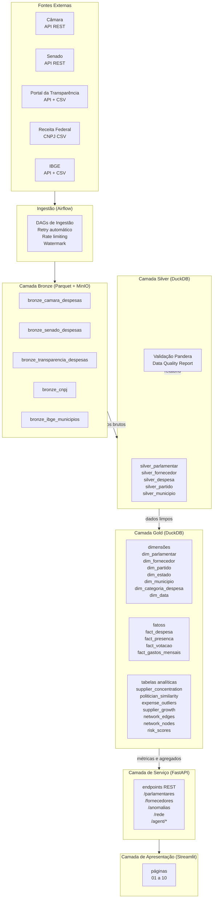

# Arquitetura Medalhão

## Camadas

| Camada | Formato | Propósito |
|---|---|---|
| **Bronze** | Parquet + MinIO | Dados raw exatos, metadados de ingestão, hash, particionado por fonte |
| **Silver** | DuckDB | Limpeza, normalização, deduplicação, validação Pandera |
| **Gold** | DuckDB | Star schema, métricas semânticas, tabelas analíticas, scores de risco |

## Convenções de Nomenclatura

| Camada | Padrão | Exemplo |
|---|---|---|
| Bronze | `bronze_{fonte}_{entidade}` | `bronze_camara_despesas` |
| Silver | `silver_{entidade}` | `silver_parlamentar` |
| Gold (fato) | `fact_{entidade}` | `fact_despesa` |
| Gold (dimensão) | `dim_{entidade}` | `dim_fornecedor` |
| Gold (analítica) | `{descricao}` | `supplier_concentration` |
