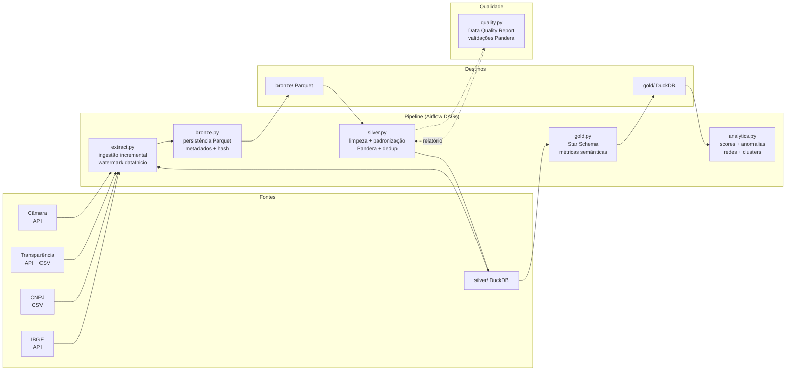

# Fluxo do Pipeline ETL

## Etapas do Pipeline

| Etapa | Módulo | Descrição |
|---|---|---|
| **Ingestão** | `pipeline/{fonte}/extract.py` | Extração incremental com watermark por `dataInicio` |
| **Bronze** | `pipeline/bronze.py` | Persistência raw em Parquet com metadados de ingestão |
| **Silver** | `pipeline/silver.py` | Limpeza, normalização, deduplicação, validação Pandera |
| **Gold** | `pipeline/gold.py` | Construção do Star Schema (fatos + dimensões) |
| **Analytics** | `pipeline/analytics.py` | Scores de risco, anomalias, análise de redes |
| **Qualidade** | `pipeline/quality.py` | Relatório de qualidade de dados por execução |

## Reproductibilidade

Toda execução é rastreável via:
- `run_id` — identificador único da execução
- `pipeline_version` — versão do código no momento da execução
- `execution_timestamp` — timestamp ISO 8601
- `source_version` — data/hora da última modificação da fonte externa
